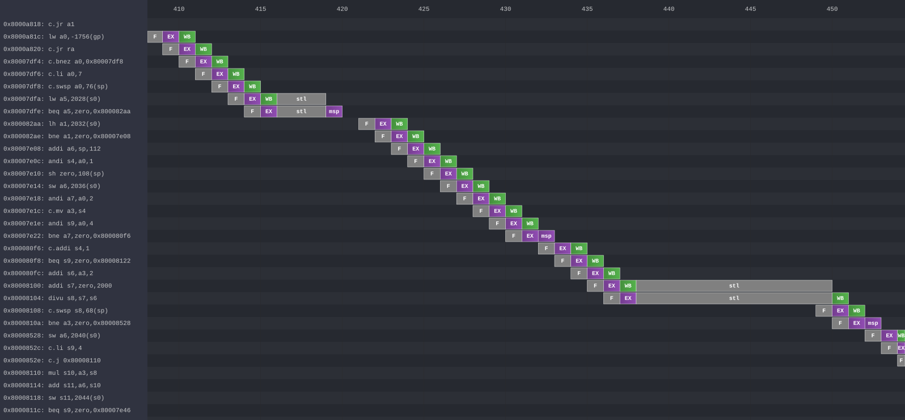

# Konata Viewer



A standalone, single-file HTML viewer for [Onikiri2-Konata](https://github.com/shioyadan/Konata) pipeline trace files (`.kanata`).

The viewer is distributed as a single self-contained HTML file (`dist/KonataViewer.html`) with no runtime dependencies — just open it in a browser.

---

## Quick Start

```sh
# Build the viewer (requires Node.js ≥ 14)
npm install
make

# Open the output in a browser
xdg-open dist/KonataViewer.html     # Linux
open dist/KonataViewer.html         # macOS
start dist/KonataViewer.html        # Windows
```

Then use the **Open** button (or **Ctrl+O**) to load a `.kanata` trace file, or click **Demo** to load the built-in example trace instantly.

---

## Project Structure

```
KonataViewer/
├── src/
│   ├── index.html      HTML template (CSS/JS injection markers)
│   ├── style.css       All styles
│   ├── constants.js    Shared constants and colour helpers
│   ├── models.js       Data model classes (Instruction, Dependency, …)
│   ├── demo.js         Embedded demo data placeholder (injected at build)
│   ├── parser.js       Konata file parser (chunked async)
│   ├── viewer.js       Canvas renderer (KonataViewer class)
│   └── app.js          UI controller (App class)
├── examples/
│   └── jv32soc.kanata  Sample trace (embedded in the built output)
├── dist/               Build output (git-ignored)
│   └── KonataViewer.html
├── build.js            Node.js build script
├── package.json
├── Makefile
└── .gitignore
```

---

## Build

The build script (`build.js`) performs:

1. Concatenates the JS modules in dependency order
2. Injects the demo trace as gzip+base64 (browser `DecompressionStream` at runtime)
3. Minifies JS with [terser](https://terser.org/) and strips CSS whitespace/comments
4. Inlines CSS and JS into the HTML template

| Make target | Description |
|---|---|
| `make` / `make build` | Build `dist/KonataViewer.html` |
| `make watch` | Rebuild on any `src/` or `examples/` change |
| `make clean` | Remove `dist/` |

Output size is approximately **70 KB** (raw sources are ~120 KB before minification).

---

## Features

| Feature | Description |
|---|---|
| **Gradient stage rendering** | Pipeline stages rendered with official Konata gradient colouring |
| **Per-cycle stall numbers** | Stall count labels on each cycle cell, matching the official viewer |
| **Lane splitting** | Expand each superscalar lane into its own sub-row (⬍ Split Lanes) |
| **Anchor mode** | Lock a selected instruction to the horizontal centre while scrolling vertically |
| **Bookmarks** | Save named positions and jump back with one click |
| **Find** | Search instructions by name or ID |
| **Minimap** | Overview panel on the right with a live viewport indicator |
| **Export SVG** | Export the current view as a self-contained SVG file |
| **Demo** | Built-in example trace loaded with a single click |

---

## Keyboard Shortcuts

| Shortcut | Action |
|---|---|
| `Ctrl+O` | Open file |
| `Ctrl+F` | Find instruction |
| `Ctrl+B` | Add bookmark |
| `+` / `-` | Zoom in / out |
| `F` | Fit visible rows to window height |
| `L` | Toggle split lanes mode |
| `Escape` | Clear selection |
| `Ctrl+Scroll` | Zoom |
| `Shift+Scroll` | Pan horizontally |

---

## Trace Format

Supports `.kanata` files produced by [Onikiri2](https://github.com/shioyadan/onikiri2) or any compatible simulator.  
Format specification: <https://github.com/shioyadan/Konata>

---

## Example Trace

`examples/jv32soc.kanata` — pipeline trace generated by the **J<sub>V</sub>32** RISC-V core running a SoC simulation.

- Core: [J<sub>V</sub>32](https://github.com/kuopinghsu/jv32) — a lightweight RISC-V RV32IMC processor
- Load via **Open** / drag-and-drop, or click **Demo** to load instantly from the built-in embedded copy
